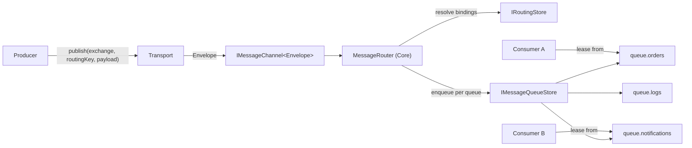
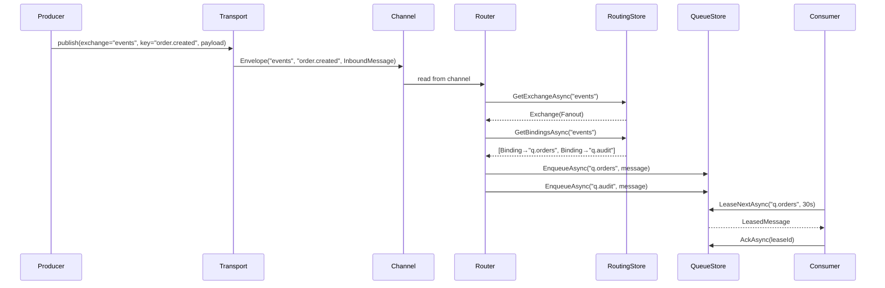

# ADR-0002: Routing Architecture — Exchanges, Bindings, Named Queues

**Status:** Proposed  
**Date:** 2026-07-12  
**Supersedes:** —  
**Relates to:** [ADR-0001](file:///D:/RocketMQ/RocketMQ/docs/adr/0001-queue-over-log.md) (Queue over Log)

---

## Context

ADR-0001 introduced `IMessageQueueStore` with RabbitMQ-style lease/ack/nack semantics, but the current design operates on a **single, anonymous queue**. There is:

- No concept of **named queues** — all messages land in one flat queue
- No **routing** — producers cannot direct messages to specific consumers
- No **exchanges** — no fanout, topic, or direct routing patterns
- No **bindings** — no rules connecting producers to consumers

`InboundMessage` carries only `ConnectionId`, `CorrelationId`, `Payload`, `ReceivedAtUtc` — no routing metadata.

For RocketMQ to function as a real message broker, we need a routing layer that decouples producers from consumers.

---

## Decision

Adopt an **AMQP-style routing model** with three concepts: **Exchanges**, **Bindings**, and **Named Queues**.

### Data Flow



### Routing Model

| Exchange Type | Routing Behavior | Use Case |
|---------------|-----------------|----------|
| **Direct** | Exact match: routingKey == binding.routingKey | Point-to-point, RPC |
| **Fanout** | Broadcast to ALL bound queues (routing key ignored) | Events, notifications |
| **Topic** | Wildcard pattern matching on dot-separated routing keys | Selective pub/sub |

### Topic Matching Rules

Routing keys are dot-separated words: `orders.eu.created`

| Pattern | Matches | Doesn't Match |
|---------|---------|---------------|
| `orders.*` | `orders.created` | `orders.eu.created` |
| `orders.#` | `orders`, `orders.created`, `orders.eu.created` | `logs.error` |
| `*.*.created` | `orders.eu.created`, `logs.us.created` | `orders.created` |
| `#` | everything | — |

- `*` (star) = exactly **one** word
- `#` (hash) = **zero or more** words

---

## New Domain Types

All in `RocketMQ.Core.Abstractions`:

```csharp
// ── Exchange types ──────────────────────────────────────────

public enum ExchangeType
{
    Direct,
    Fanout,
    Topic
}

public sealed record Exchange(
    string Name,
    ExchangeType Type,
    bool Durable          // Survives broker restart
);

// ── Queue definition ────────────────────────────────────────

public sealed record QueueDefinition(
    string Name,
    bool Durable,
    int MaxDeliveryCount   // After N leases → auto dead-letter (0 = unlimited)
);

// ── Binding ─────────────────────────────────────────────────

public sealed record Binding(
    string ExchangeName,
    string QueueName,
    string RoutingKey      // Exact for Direct, pattern for Topic, ignored for Fanout
);

// ── Envelope (replaces raw InboundMessage on the channel) ──

public sealed record Envelope(
    string ExchangeName,
    string RoutingKey,
    InboundMessage Message
);
```

> [!IMPORTANT]
> `InboundMessage` stays **unchanged** — it remains the transport-agnostic data unit. Routing metadata lives in `Envelope`, which wraps `InboundMessage` via composition (same pattern as `LeasedMessage`).

---

## New Port: `IRoutingStore`

Persists exchange, queue, and binding metadata. This is a **port** (interface in Core), implemented by adapters (SQLite, WAL, etc.).

```csharp
public interface IRoutingStore
{
    // ── Exchanges ──
    Task DeclareExchangeAsync(Exchange exchange, CancellationToken ct);
    Task DeleteExchangeAsync(string exchangeName, CancellationToken ct);
    Task<Exchange?> GetExchangeAsync(string exchangeName, CancellationToken ct);
    Task<IReadOnlyList<Exchange>> ListExchangesAsync(CancellationToken ct);

    // ── Queues ──
    Task DeclareQueueAsync(QueueDefinition queue, CancellationToken ct);
    Task DeleteQueueAsync(string queueName, CancellationToken ct);
    Task<QueueDefinition?> GetQueueAsync(string queueName, CancellationToken ct);
    Task<IReadOnlyList<QueueDefinition>> ListQueuesAsync(CancellationToken ct);

    // ── Bindings ──
    Task BindAsync(Binding binding, CancellationToken ct);
    Task UnbindAsync(string exchangeName, string queueName, string routingKey, CancellationToken ct);
    Task<IReadOnlyList<Binding>> GetBindingsAsync(string exchangeName, CancellationToken ct);
}
```

**Idempotency rule:** `DeclareExchangeAsync` and `DeclareQueueAsync` are idempotent — declaring an existing entity with the same configuration is a no-op. Declaring with **different** configuration throws `InvalidOperationException`.

---

## Changes to Existing Port: `IMessageQueueStore`

The queue store gains a `queueName` parameter on operations that target a specific queue:

```diff
 public interface IMessageQueueStore
 {
-    Task<Guid> EnqueueAsync(InboundMessage message, CancellationToken ct);
+    Task<Guid> EnqueueAsync(string queueName, InboundMessage message, CancellationToken ct);

-    Task<LeasedMessage?> LeaseNextAsync(TimeSpan visibilityTimeout, CancellationToken ct);
+    Task<LeasedMessage?> LeaseNextAsync(string queueName, TimeSpan visibilityTimeout, CancellationToken ct);

     Task AckAsync(Guid leaseId, CancellationToken ct);            // unchanged
     Task NackAsync(Guid leaseId, bool requeue, CancellationToken ct);  // unchanged

-    IAsyncEnumerable<DeadLetteredMessage> BrowseDeadLettersAsync(CancellationToken ct);
+    IAsyncEnumerable<DeadLetteredMessage> BrowseDeadLettersAsync(string queueName, CancellationToken ct);
 }
```

> [!NOTE]
> `AckAsync` and `NackAsync` stay unchanged — `leaseId` is globally unique, so queue name is not needed. The store resolves the queue internally from the lease.

---

## Core Logic: `IMessageRouter`

This is **not** a port — it's core business logic that lives in `RocketMQ.Core`. It depends only on `IRoutingStore` (a port).

```csharp
public interface IMessageRouter
{
    /// Resolves which queues a message should be routed to.
    /// Returns empty list if exchange exists but no bindings match.
    /// Throws if exchange does not exist.
    Task<IReadOnlyList<string>> ResolveAsync(
        string exchangeName,
        string routingKey,
        CancellationToken ct);
}
```

Implementation:

```csharp
public sealed class MessageRouter : IMessageRouter
{
    private readonly IRoutingStore _store;

    public MessageRouter(IRoutingStore store) => _store = store;

    public async Task<IReadOnlyList<string>> ResolveAsync(
        string exchangeName, string routingKey, CancellationToken ct)
    {
        var exchange = await _store.GetExchangeAsync(exchangeName, ct)
            ?? throw new InvalidOperationException($"Exchange '{exchangeName}' does not exist.");

        var bindings = await _store.GetBindingsAsync(exchangeName, ct);

        return exchange.Type switch
        {
            ExchangeType.Fanout => bindings.Select(b => b.QueueName).Distinct().ToList(),
            ExchangeType.Direct => bindings
                .Where(b => b.RoutingKey == routingKey)
                .Select(b => b.QueueName).Distinct().ToList(),
            ExchangeType.Topic => bindings
                .Where(b => TopicMatcher.Matches(b.RoutingKey, routingKey))
                .Select(b => b.QueueName).Distinct().ToList(),
            _ => throw new InvalidOperationException($"Unknown exchange type: {exchange.Type}")
        };
    }
}
```

`TopicMatcher` is a pure static helper class with the `*` / `#` matching algorithm.

---

## Default Exchange

Following AMQP convention, the broker creates a **default direct exchange** on startup:

| Property | Value |
|----------|-------|
| Name | `""` (empty string) |
| Type | `Direct` |
| Durable | `true` |

**Auto-binding rule:** When a queue is declared, it is automatically bound to the default exchange with `routingKey = queueName`. This enables simple point-to-point messaging:

```
publish(exchange: "", routingKey: "my-queue", payload) → delivers to "my-queue"
```

---

## Message Pipeline (End-to-End)



---

## Impact on Existing Code

### Breaking Changes

| Component | Change | Effort |
|-----------|--------|--------|
| `IMessageQueueStore` | Add `queueName` param to 3 methods | Low |
| `IMessageChannel<T>` usage | Channel carries `Envelope` instead of `InboundMessage` | Low |
| Contract tests | Update to pass queue name | Low |
| SQLite adapter stubs | Update method signatures | Low |
| WAL adapter stubs | Update method signatures | Low |

### New Code Required

| Component | Location | Effort |
|-----------|----------|--------|
| 4 domain types + 1 enum | `Core/Abstractions/` | Low |
| `IRoutingStore` interface | `Core/Abstractions/` | Low |
| `MessageRouter` + `TopicMatcher` | `Core/Routing/` | Medium |
| `IRoutingStore` contract tests | `tests/Contract.Tests/` | Medium |
| `IRoutingStore` SQLite adapter | `Persistence.Sqlite/` | Medium |
| `MessageRouter` unit tests | `tests/Runner.Unit.Tests/` or new project | Medium |

### Unchanged

| Component | Why |
|-----------|-----|
| `InboundMessage` | Routing metadata lives in `Envelope`, not here |
| `LeasedMessage` | Operates below routing layer |
| `DeadLetteredMessage` | Operates below routing layer |
| `IPersistenceStore` | Orthogonal — append-only log stays as-is |
| `ITransportServer` | Transport pushes `Envelope` into channel, interface unchanged |

---

## Risks

| Risk | Mitigation |
|------|------------|
| Topic matching perf with many bindings | Cache compiled patterns; for MVP linear scan is fine (< 1000 bindings) |
| Routing store becomes bottleneck | In-memory cache with invalidation; `IRoutingStore` called per-publish initially, cached later |
| Breaking change to `IMessageQueueStore` | All adapters are stubs — no production code breaks |
| Complexity creep | Start with Direct + Fanout only; Topic can be Phase 2 |

---

## Alternatives Considered

### A. Kafka-style Topics with Partitions
- Simpler model (topic → partitions → consumer groups)
- Rejected: ADR-0001 already committed to RabbitMQ-style queue semantics; mixing models adds confusion

### B. Routing Key on `InboundMessage`
- Add `RoutingKey` and `ExchangeName` directly to `InboundMessage`
- Rejected: pollutes the transport-agnostic data model; `InboundMessage` should remain the raw unit of data. `Envelope` wraps it cleanly via composition.

### C. Exchange-to-Exchange Bindings
- RabbitMQ supports binding exchanges to other exchanges
- Rejected for now: significant complexity, no clear use case at this stage. Can be added later without breaking changes.

---

## Implementation Order

| Phase | Work | Depends On |
|-------|------|------------|
| **1** | New types: `Exchange`, `ExchangeType`, `QueueDefinition`, `Binding`, `Envelope` | — |
| **2** | Update `IMessageQueueStore` signatures + contract tests | Phase 1 |
| **3** | New `IRoutingStore` interface + contract tests | Phase 1 |
| **4** | `MessageRouter` + `TopicMatcher` + unit tests | Phase 1, 3 |
| **5** | SQLite adapters: `IRoutingStore` impl + update `IMessageQueueStore` impl | Phase 2, 3 |
| **6** | Default exchange bootstrap in Runner | Phase 4, 5 |
