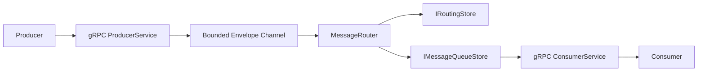

# Architecture

RocketMQ uses a hexagonal architecture. The core defines broker behavior through ports; transport and storage are adapters.

## Core model

- `InboundMessage` is immutable payload data with connection, correlation, and receive-time metadata.
- `Envelope` adds exchange and routing-key metadata while the message traverses the broker.
- `Exchange` supports `Direct`, `Fanout`, and `Topic` routing.
- `Binding` connects an exchange to a named queue.
- `QueueDefinition` carries durability metadata and a maximum delivery count.

The core projects are under `src/Core/RocketMQ.Core`. They must not depend on gRPC, SQLite, or WAL implementation details. `MessageRouter` resolves bindings and deduplicates target queue names before enqueueing.

## Delivery semantics

`IMessageQueueStore` implements competing-consumer delivery:

1. `EnqueueAsync` makes a message available on a named queue.
2. `LeaseNextAsync` atomically leases the oldest available message.
3. `AckAsync` permanently removes a successfully processed message.
4. `NackAsync(..., requeue: true)` returns it to the queue; `false` moves it to dead letters.
5. An expired lease becomes available for redelivery.

This is at-least-once delivery. Consumers must be idempotent because a message can be delivered more than once, especially after a crash or visibility-timeout expiry.

## Routing

| Exchange | Match rule | Typical use |
| --- | --- | --- |
| Direct | Exact routing-key match | Point-to-point work |
| Fanout | Every bound queue; key ignored | Broadcast events |
| Topic | Dot-separated patterns; `*` is one word and `#` is zero or more | Selective subscriptions |

The transport is implemented in `src/Transport/RocketMQ.Transport.Grpc` and listens on port `50051` with HTTP/2. The local runner registers `InMemoryMessageQueueStore` and `InMemoryRoutingStore`; the SQLite and WAL adapters are planned persistence implementations and currently contain unimplemented methods.

## Design records

Read [ADR-0001](adr/0001-queue-over-log.md) for queue semantics, [ADR-0002](adr/0002_routing_architecture.md) for routing, [ADR-0003](adr/0003_grpc_transport_layer.md) for gRPC, and [ADR-0004](adr/0004_client_sdk_architecture.md) for the SDK direction.
